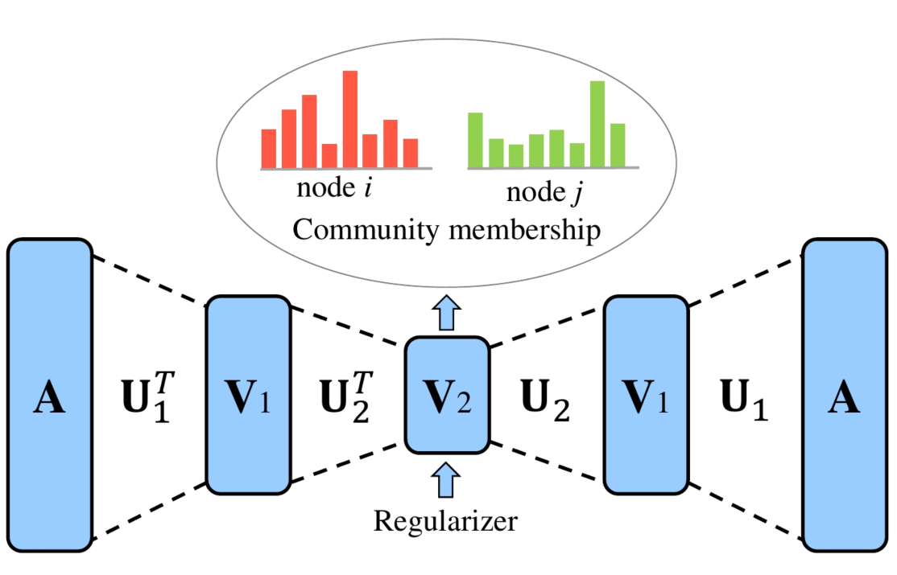

DANMF
============================================
<p align="justify">
A sparsity aware implementation of "Deep Autoencoder-like Nonnegative Matrix Factorization for Community Detection" (CIKM 2018). Community structure is ubiquitous in real-world complex networks. The task of community detection over these networks is of paramount importance in a variety of applications. Recently, nonnegative matrix factorization (NMF) has been widely adopted for community detection due to its great interpretability and its natural fitness for capturing the community membership of nodes. However, the existing NMF-based community detection approaches are shallow methods. They learn the community assignment by mapping the original network to the community membership space directly. Considering the complicated and diversified topology structures of real-world networks, it is highly possible that the mapping between the original network and the community membership space contains rather complex hierarchical information, which cannot be interpreted by classic shallow NMF-based approaches. Inspired by the unique feature representation learning capability of deep autoencoder, we propose a novel model, named Deep Autoencoder-like NMF (DANMF), for community detection. Similar to deep autoencoder, DANMF consists of an encoder component and a decoder component. This architecture empowers DANMF to learn the hierarchical mappings between the original network and the final community  assignment  with  implicit  low-to-high  level  hidden attributes of the original network learnt in the intermediate layers. Thus, DANMF should be better suited to the community detection task. Extensive experiments on benchmark datasets demonstrate that DANMF can achieve better performance than the state-of-the-art NMF-based community detection approaches.</p>
<div style="text-align:center"></div>

This repository provides an implementation for DANMF as described in the paper:

> Deep Autoencoder-like Nonnegative Matrix Factorization for Community Detection.
> Fanghua Ye, Chuan Chen, and Zibin Zheng.
> CIKM, 2018.
> [[Paper]](https://smartyfh.com/Documents/18DANMF.pdf)


### Requirements

The codebase is implemented in Python 3.5.2. package versions used for development are just below.
```
networkx          1.11
tqdm              4.28.1
numpy             1.15.4
pandas            0.23.4
texttable         1.5.0
scipy             1.1.0
argparse          1.1.0
sklearn           0.20.0
```
### Datasets

The code takes an input graph in a csv file. Every row indicates an edge between two nodes separated by a comma. The first row is a header. Nodes should be indexed starting with 0. Sample graphs for the `Twitch Brasilians` ,`Wikipedia Chameleons` and `Wikipedia Giraffes` are included in the  `input/` directory. 

### Options

Learning of the embedding is handled by the `src/main.py` script which provides the following command line arguments.

#### Input and output options

```
  --edge-path    STR     Input graph path.           Default is `input/ptbr_edges.csv`.
  --feature-path STR     Input Features path.        Default is `input/ptbr_features.json`.
  --output-path  STR     Embedding path.             Default is `output/ptbr_bane.csv`.
```

#### Model options

```
  --features               STR         Structure of the feature matrix.       Default is `sparse`. 
  --dimensions             INT         Number of embeding dimensions.         Default is 48.
  --order                  INT         Order of adjacency matrix powers.      Default is 1.
  --binarization-rounds    INT         Number of power interations.           Default is 10.
  --approximation-rounds   INT         Number of CDC interations.             Default is 5.
  --alpha                  FLOAT       Regularization parameter.              Default is 0.7.
  --gamma                  FLOAT       Weisfeiler-Lehman mixing parameter.    Default is 0.1.  
```

### Examples

The following commands learn a graph embedding and write the embedding to disk. The node representations are ordered by the ID.

Creating a BANE embedding of the default dataset with the default hyperparameter settings. Saving the embedding at the default path.

```
python src/main.py
```
Creating a BANE embedding of the default dataset with 128 dimensions and approximation order 1.

```
python src/main.py --dimensions 128 --order 1
```

Creating a BANE embedding of the default dataset with asymmetric mixing.

```
python src/main.py --gamma 0.1
```

Creating an embedding of an other dense structured dataset the `Wikipedia Giraffes`. Saving the output in a custom folder.

```
python src/main.py --edge-path input/giraffe_edges.csv --feature-path input/giraffe_features.csv --output-path output/giraffe_bane.csv --features dense
```

